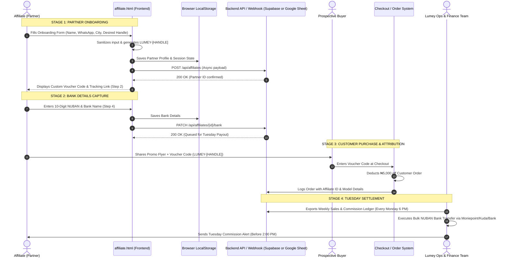

# LUMEY ENERGY: AFFILIATE DATABASE ARCHITECTURE & DEVELOPER HANDOFF MANUAL
## The Complete Technical & Operational Blueprint for System Integration, Database Flow, and Team Collaboration
*(Harmonized with Official August 2026 Product Catalogue, Pricing Guide & Distribution Architecture)*

---

## 1. EXECUTIVE SUMMARY & ARCHITECTURAL PHILOSOPHY

The Lumey Affiliate Engine is built on a **High-Performance, Zero-Dependency Architecture**. 

Instead of relying on fragile, heavy frameworks (like bloated React/Next.js scaffolds with thousands of vulnerable npm dependencies), the frontends (`affiliate.html`, `sales_page.html`, `index.html`) are engineered with **standards-compliant Vanilla HTML5, modern CSS3 (Custom Properties), and Vanilla JavaScript (ES6+)**.

### The 3 Core Advantages for Any New Team Member:
1. **Zero Setup Friction:** Anyone can double-click `affiliate.html` on any operating system (Windows, Mac, Linux) and it works immediately in any browser with zero compilation or installation.
2. **Infinite Database Flexibility:** The frontend is completely decoupled from the database. It works standalone (using browser `localStorage`), connects to a simple **Google Sheets Webhook** in 3 minutes for non-technical team members, or connects to a **Supabase / PostgreSQL / Firebase** cloud backend for enterprise production.
3. **Instant Portability:** The entire project can be hosted for ₦0/month on Vercel, Netlify, Cloudflare Pages, GitHub Pages, or copied to any cPanel/Apache web server.

---

## 2. END-TO-END DATA FLOW ARCHITECTURE



---

## 3. DATABASE SCHEMA SPECIFICATION (RELATIONAL DDL)

If connecting to **PostgreSQL, Supabase, MySQL, or SQLite**, execute the following schema to establish the full data model:

```sql
-- ==============================================================================
-- 1. AFFILIATES MASTER TABLE
-- ==============================================================================
CREATE TABLE IF NOT EXISTS affiliates (
    id UUID PRIMARY KEY DEFAULT gen_random_uuid(),
    partner_id VARCHAR(32) UNIQUE NOT NULL,         -- e.g. LUM-7842
    full_name VARCHAR(128) NOT NULL,
    whatsapp_phone VARCHAR(20) NOT NULL UNIQUE,
    city_state VARCHAR(64) NOT NULL,
    promotion_channel VARCHAR(64) NOT NULL,         -- WhatsApp Status, Instagram, Tech Group, etc.
    custom_handle VARCHAR(32) NOT NULL,             -- e.g. CHUKS
    partner_code VARCHAR(48) UNIQUE NOT NULL,       -- e.g. LUMEY-CHUKS
    referral_link TEXT NOT NULL,
    tier VARCHAR(24) DEFAULT 'Starter (5.0%)',      -- Starter, Active, Pro, Ambassador
    commission_rate NUMERIC(4, 2) DEFAULT 0.05,     -- 0.05, 0.075, 0.10, 0.12
    total_sales_count INT DEFAULT 0,
    total_revenue_generated NUMERIC(14, 2) DEFAULT 0.00,
    total_commission_earned NUMERIC(14, 2) DEFAULT 0.00,
    is_active BOOLEAN DEFAULT TRUE,
    created_at TIMESTAMP WITH TIME ZONE DEFAULT CURRENT_TIMESTAMP,
    updated_at TIMESTAMP WITH TIME ZONE DEFAULT CURRENT_TIMESTAMP
);

-- ==============================================================================
-- 2. BANK SETTLEMENT ACCOUNTS
-- ==============================================================================
CREATE TABLE IF NOT EXISTS affiliate_bank_accounts (
    id UUID PRIMARY KEY DEFAULT gen_random_uuid(),
    affiliate_id UUID REFERENCES affiliates(id) ON DELETE CASCADE,
    bank_name VARCHAR(64) NOT NULL,                 -- GTBank, Access, Zenith, Opay, etc.
    nuban_account_number VARCHAR(10) NOT NULL,      -- 10-digit standard NUBAN
    account_name_resolved VARCHAR(128) NOT NULL,    -- Auto-resolved legal name
    is_verified BOOLEAN DEFAULT TRUE,
    created_at TIMESTAMP WITH TIME ZONE DEFAULT CURRENT_TIMESTAMP
);

-- ==============================================================================
-- 3. REFERRAL CLICKS & ENGAGEMENT LOG
-- ==============================================================================
CREATE TABLE IF NOT EXISTS referral_clicks (
    id UUID PRIMARY KEY DEFAULT gen_random_uuid(),
    partner_code VARCHAR(48) NOT NULL,
    visitor_ip_hash VARCHAR(64),
    user_agent TEXT,
    utm_source VARCHAR(64),
    landing_page VARCHAR(128),
    clicked_at TIMESTAMP WITH TIME ZONE DEFAULT CURRENT_TIMESTAMP
);

-- ==============================================================================
-- 4. CUSTOMER ORDERS & ATTRIBUTION
-- ==============================================================================
CREATE TABLE IF NOT EXISTS customer_orders (
    id UUID PRIMARY KEY DEFAULT gen_random_uuid(),
    order_number VARCHAR(32) UNIQUE NOT NULL,       -- e.g. ORD-2026-0801
    customer_name VARCHAR(128) NOT NULL,
    customer_phone VARCHAR(20) NOT NULL,
    delivery_city VARCHAR(64) NOT NULL,
    delivery_state VARCHAR(64) NOT NULL,
    powerbox_model VARCHAR(32) NOT NULL,            -- PB 600, PB 1500, PB 2600, etc.
    combo_retail_price NUMERIC(12, 2) NOT NULL,     -- e.g. 730000.00
    voucher_code_applied VARCHAR(48),               -- LUMEY-CHUKS
    voucher_discount_amount NUMERIC(10, 2) DEFAULT 5000.00,
    final_amount_paid NUMERIC(12, 2) NOT NULL,
    affiliate_id UUID REFERENCES affiliates(id),
    commission_rate_applied NUMERIC(4, 2) NOT NULL,
    commission_amount NUMERIC(12, 2) NOT NULL,
    order_status VARCHAR(32) DEFAULT 'Confirmed',   -- Pending, Confirmed, Crated, Dispatched, Delivered, Cancelled
    created_at TIMESTAMP WITH TIME ZONE DEFAULT CURRENT_TIMESTAMP
);

-- ==============================================================================
-- 5. TUESDAY COMMISSION PAYOUT SETTLEMENTS
-- ==============================================================================
CREATE TABLE IF NOT EXISTS commission_payouts (
    id UUID PRIMARY KEY DEFAULT gen_random_uuid(),
    settlement_cycle_date DATE NOT NULL,            -- Next Tuesday's date
    affiliate_id UUID REFERENCES affiliates(id),
    order_ids UUID[] NOT NULL,
    total_payout_amount NUMERIC(12, 2) NOT NULL,
    bank_name VARCHAR(64) NOT NULL,
    nuban_account_number VARCHAR(10) NOT NULL,
    payment_status VARCHAR(32) DEFAULT 'Queued',    -- Queued, Processing, Paid, Failed
    bank_transfer_reference VARCHAR(64),            -- Central bank / NIP session ID
    paid_at TIMESTAMP WITH TIME ZONE
);
```

---

## 4. HOW ANOTHER PERSON RUNS & USES THE REPOSITORY

Give these exact instructions to any developer, designer, or assistant joining the project:

### Step 1: Clone or Copy the Repository
No build tools or compilers are required.
```bash
git clone https://github.com/your-username/lumey-energy.git
cd lumey-energy
```

### Step 2: Run the Local Development Server
Pick whichever tool is already installed on the computer:

* **Option A: PowerShell Server (Pre-configured for Windows)**
  ```powershell
  powershell -ExecutionPolicy Bypass -File .\server.ps1
  ```
  *Opens immediately at `http://localhost:8080`.*

* **Option B: Python (Available on Mac, Linux, Windows)**
  ```bash
  python -m http.server 8080
  ```

* **Option C: Node.js (If Node is installed)**
  ```bash
  npx serve .
  ```

* **Option D: VS Code Live Server Extension**
  * Right-click `affiliate.html` -> click **"Open with Live Server"**.

### Step 3: File Organization Cheat Sheet

| File | Purpose | Who Works on It |
| :--- | :--- | :--- |
| `affiliate.html` | The master Affiliate Hub, Calculator, Load Matcher, Swipe Engine & Onboarding Wizard | Web Dev / Copywriter |
| `sales_page.html` | High-converting direct customer sales page for Lumey PowerBoxes | Copywriter / CRO |
| `index.html` | Lumey Energy official homepage | Web Dev / Designer |
| `server.ps1` | Zero-dependency local web server daemon | Developers |
| `lumey_*_flyer.jpg` | 1:1 Square marketing flyers (Recruitment, PB 1500, PB 2600, PB 600) | Graphic Designers |
| `*.pdf` | Printable master decks (Onboarding Flow & Copy Vault) | Operations / Affiliates |

---

## 5. CONNECTING THE FRONTEND TO A REAL DATABASE (3 WAYS)

`affiliate.html` is designed with an **Adapter Pattern**. A new developer can choose between 3 backend integrations by editing only 5 lines of code at the top of the script in `affiliate.html`:

```javascript
// ==============================================================================
// BACKEND CONFIGURATION OBJECT (In affiliate.html)
// ==============================================================================
const LUMEY_CONFIG = {
  // Option 1: Google Apps Script Webhook URL (Takes 3 mins, non-technical)
  // Option 2: Supabase REST URL (e.g., https://xyz.supabase.co/rest/v1/affiliates)
  // Option 3: Leave empty ("") to use built-in LocalStorage with CSV Export
  API_ENDPOINT: "", 
  API_KEY: "", // If using Supabase / API Gateway
  USE_LOCAL_STORAGE_BACKUP: true
};
```

---

### INTEGRATION METHOD 1: Free Google Sheets Webhook (3-Minute Setup for Non-Developers)
If you don't have a backend developer and want all partner signups to flow instantly into a live Google Sheet:

1. Create a new Google Sheet named **"Lumey Affiliates 2026"**.
2. Set row 1 headers: `Timestamp | Partner ID | Name | WhatsApp | City | Channel | Code | Bank | NUBAN | Status`.
3. Click **Extensions > Apps Script**, paste this code, and click **Deploy > New Deployment > Web App** (Access: *Anyone*):

```javascript
function doPost(e) {
  try {
    var sheet = SpreadsheetApp.getActiveSpreadsheet().getActiveSheet();
    var data = JSON.parse(e.postData.contents);
    
    sheet.appendRow([
      new Date(),
      data.partnerId,
      data.fullName,
      data.whatsappPhone,
      data.cityState,
      data.promotionChannel,
      data.partnerCode,
      data.bankName || "Pending",
      data.nubanAccountNumber || "Pending",
      "Active"
    ]);
    
    return ContentService.createTextOutput(JSON.stringify({status: "success"}))
      .setMimeType(ContentService.MimeType.JSON);
  } catch (err) {
    return ContentService.createTextOutput(JSON.stringify({status: "error", message: err.toString()}))
      .setMimeType(ContentService.MimeType.JSON);
  }
}
```
4. Copy the deployment URL (e.g. `https://script.google.com/macros/s/.../exec`) and paste it into `LUMEY_CONFIG.API_ENDPOINT` in `affiliate.html`. **Done! Every signup lands in Google Sheets instantly.**

---

### INTEGRATION METHOD 2: Supabase (Production Cloud Database)
For an automated enterprise database:
1. Create a free project at [supabase.com](https://supabase.com).
2. Go to the **SQL Editor**, paste the SQL schema from Section 3 above, and click **Run**.
3. In `affiliate.html`, enter your Supabase URL and public Anon Key:
```javascript
const LUMEY_CONFIG = {
  API_ENDPOINT: "https://your-project.supabase.co/rest/v1/affiliates",
  API_KEY: "your-anon-key-here",
  USE_LOCAL_STORAGE_BACKUP: true
};
```

---

### INTEGRATION METHOD 3: Built-in Browser Database & 1-Click CSV Export (Built Right into `affiliate.html`)
Even without any server or external database configured, `affiliate.html` automatically:
- Saves every applicant to the browser's persistent `localStorage`.
- Restores their active session if they return or refresh.
- Includes an **Admin / Team Data Drawer** where any team member can click **"Export All Partners to CSV"** to download an Excel-ready spreadsheet of all applicants and their NUBAN bank details!

---

## 6. FREE PRODUCTION HOSTING & DEPLOYMENT IN 60 SECONDS

Anyone on your team can deploy the website to a live public HTTPS domain for free:

### A. Deploy via Vercel (Recommended)
1. Push this folder to a GitHub repository.
2. Go to [vercel.com](https://vercel.com) -> click **"Add New Project"** -> Select your repo.
3. Keep default settings -> Click **"Deploy"**.
4. Your site is live on a global CDN with free automatic SSL certificates!

### B. Deploy via Netlify
1. Drag and drop the `Lumey` folder directly onto [app.netlify.com/drop](https://app.netlify.com/drop).
2. Live in 10 seconds with zero terminal commands!

### C. Deploy to Traditional cPanel (Namecheap / Whogohost / QServer)
1. Zip the files inside `c:\Users\Stephycopy\Desktop\Lumey\`.
2. Open cPanel -> **File Manager** -> `public_html`.
3. Click **Upload** -> Select your `.zip` -> Click **Extract**.
4. Your website is instantly accessible at `https://yourdomain.com/affiliate.html`.

---

## 7. TUESDAY SETTLEMENT OPERATIONAL SOP (FOR FINANCE TEAM)

Every Monday and Tuesday, the operations team follows this 4-step routine:

1. **Monday 5:00 PM (Reconciliation):**
   * Open the Admin Data Drawer or Google Sheet/Supabase database.
   * Filter orders confirmed between last Tuesday and today.
   * Cross-reference the applied `[PARTNER_CODE]` against the affiliate's tier (5%, 7.5%, 10%, or 12%).
2. **Tuesday 10:00 AM (Batch Queue):**
   * Compile the bulk transfer list: `NUBAN | Bank Name | Verified Name | Payout Amount`.
   * Check for first-time sellers within 14 days and add the **₦5,000 Cash Accelerator Bonus**.
3. **Tuesday 1:00 PM (Disbursement):**
   * Execute bulk transfers via your Nigerian corporate bank or business account (Moniepoint MFB, Kuda Business, or commercial internet banking).
4. **Tuesday 2:00 PM (Proof Distribution):**
   * Send WhatsApp confirmation to paid affiliates: *"Your Tuesday payout has landed! Share your alert with Swipe #2 to recruit new buyers."*

---
*Document permanently stored in the repository root for all incoming developers and operational personnel.*
